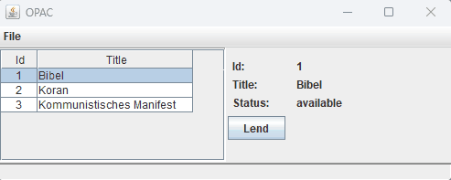
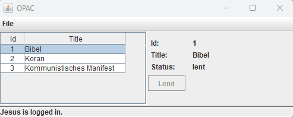

# demolibrary

Library demonstrator of the ESC component framework

Shows especially:
* Extensions
* Pattern Matching

## Highlights
Once the login dialog is open for more than 5 seconds a "support message" occurs within the status line:



Code:
```Java
@Extension(type=OpacFrameAuthentification.class, extendz=OpacFrame.class) …
public class OpacFrameAuthentificationImpl { …
   @Within(interval=5000, methodName="loginSupport")
   public boolean login() {
      LoginDialog ld = InstanceAllocator.create(LoginDialog.class, 
         core.getOpacFrameImpl(), core.getLibrary());
      ld.init();
      boolean success = ld.getUser() != null;
      if (success) {
         core.setUser(ld.getUser());
         thiz.startLowTrafficObservation();
      }
      thiz.updateView();
      return success;
   }

   public void loginSupport() {
      lblUserStatus.setText("Please enter username and password.");
   }
}
```

Once the User is inactive for more than 5 seconds a countdown starts from 30 seconds. Automatic logout happens after but can be interrupted by user activity:



Code:
```Java
@Tick(interval=1000, invocations=30, activateMethod="startCountdown", deactivateMethod="stopCountdown")
public void doCountdown() {
	if (--countdownCounter > 0)
		lblUserStatus.setText("Automatic logout in " + countdownCounter + " seconds.");
	else logout(); 
}
```

## Installation
See https://github.com/chrissilb/escframework#installation

In eclipse target/generated-sources must be added as source folder. In IntelliJ it simply should work.

## Usage
See https://gwasch.de/escframework.php - "Folien" (only available in German so far)

