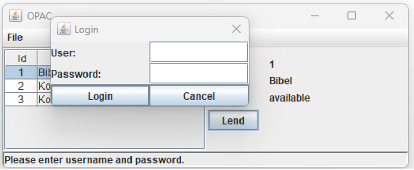
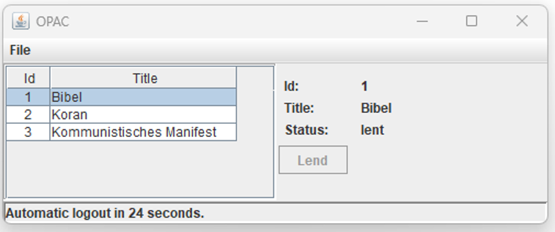

# demolibrary

Library demonstrator of the ESC component framework

Shows especially:
* Extensions
* Pattern Matching

## Highlights
Once the login dialog is open for more than 5 seconds a "support message" occurs within the status line:

Code:
	code block

Once the User is inactive for more than 5 seconds a countdown starts from 30 seconds. Automatic logout happens after but can be interrupted by user activity:

